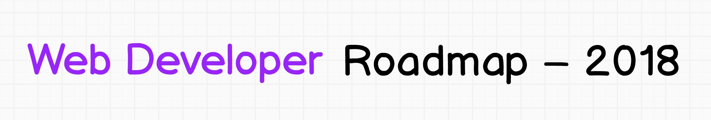

## 🚀 Introduction

- [x] Git
- [x] SSH
- [x] HTTP/HTTPS and APIs
- [x] Basic Terminal Usage
- [x] Learn to Research
- [ ] Data Structures & Algorithms
- [x] Character Encodings
- [x] GitHub

## 🎨 Frontend Roadmap

Learn HTML
- [x] 1.
- [x] 2.
- [ ] 3.
- [x] 4.

Learn CSS
- [x] 1.
- [x] 2.
- [x] 3.
- [ ] 4.

Learn JavaScript
- [ ] 1.
- [ ] 2.
- [ ] 3.
- [ ] 4.
- [ ] 5.

- [ ] Learn jQuery

## 👽 Back-end Roadmap

## 👷 DevOps Roadmap

## ☑ TODO

- [X] Add Frontend Roadmap
- [X] Add Backend Roadmap
- [X] Add DevOps Roadmap
- [ ] Add relevant resources for each
